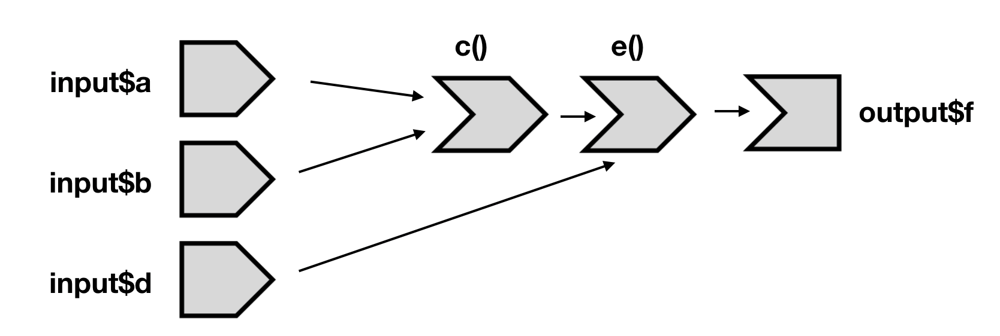
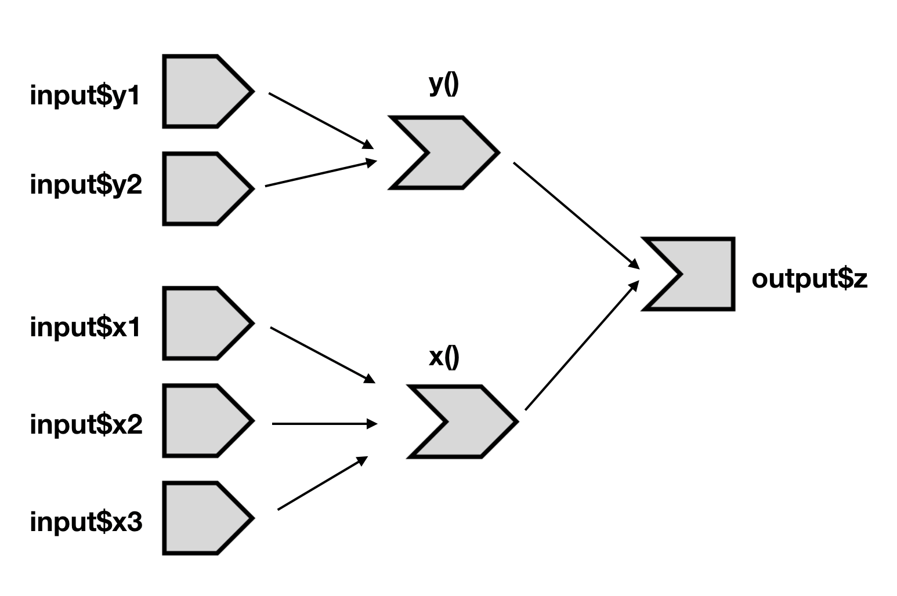
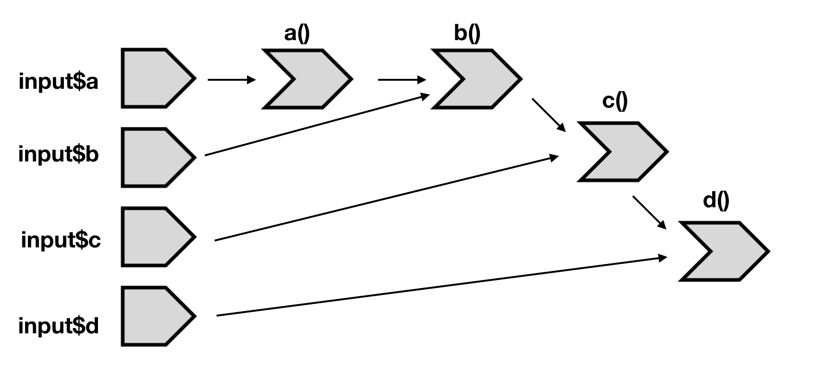

# Basic Reactivity

## 4.3.6.1 {-}

Draw the reactive graph for the following server functions:

```{r, eval=FALSE}
server1 <- function(input, output, session) {
  c <- reactive(input$a + input$b)
  e <- reactive(c() + input$d)
  output$f <- renderText(e())
}
```

</img>

```{r, eval=FALSE}
server2 <- function(input, output, session) {
  x <- reactive(input$x1 + input$x2 + input$x3)
  y <- reactive(input$y1 + input$y2)
  output$z <- renderText(x() / y())
}
```

</img>

```{r, eval=FALSE}
server3 <- function(input, output, session) {
  d <- reactive(c() ^ input$d)
  a <- reactive(input$a * 10)
  c <- reactive(b() / input$c) 
  b <- reactive(a() + input$b)
}
```

</img>

## 4.3.6.2 {-}

Can the reactive graph contain a cycle? Why/why not?

No! This will create circular references and a recursion loop!

## 4.4.6.1 TODO {-}

Use reactive expressions to reduce the duplicated code in the following simple apps.

:::note
Unclear what apps this question is referring to
:::
