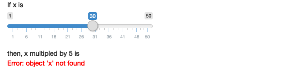

# Your First Shiny App

### Exercise 2.8.1 {-}

Create an app that greets the user by name. You don't know all the functions
you need to do this yet, so I've included some lines of code below. Figure out
which lines you'll use and then copy and paste them into the right place in a
Shiny app.

```{r, eval=FALSE}
textInput("name", "What's your name?")
renderText({
  paste0("Hello ", input$name)
})
numericInput("age", "How old are you?")
textOutput("greeting")
tableOutput("mortgage")
renderPlot("histogram", {
  hist(rnorm(1000))
}, res = 96)
```

:::solution
#### Solution {-}

In the UI, we will need a `textInput` for the user to input text, and
a `textOutput` to output any custom text to the app. The corresponding server
function to `textOutput` is `renderText`, which we can use to compose the
output element we've named "greeting".

```{r, eval=FALSE}
library(shiny)

ui <- fluidPage(
  textInput("name", "What's your name?"),
  textOutput("greeting")
)

server <- function(input, output, session) {
  output$greeting <- renderText({
    paste0("Hello ", input$name)
  })
}

shinyApp(ui, server)
```
:::

<!---------------------------------------------------------------------------->
<!---------------------------------------------------------------------------->
<!---------------------------------------------------------------------------->

## Exercise 2.8.2 {-}

Suppose your friend wants to design an app that allows the user to set a number
(`x`) between 1 and 50, and displays the result of multiplying this number by
5. This is their first attempt:
  
```{r eval=FALSE}
ui <- fluidPage(
  sliderInput("x", label = "If x is", min = 1, max = 50, value = 30),
  "then x times 5 is",
  textOutput("product")
)

server <- function(input, output, session) {
  output$product <- renderText({ 
    x * 5
  })
}
```

But unfortunately it has an error:

<br>
<center>

</center>
Can you help them find and correct the error?

:::solution
#### Solution {-}

The error here arises because on the server side we need to write `input$x`
rather than `x`. By writing `x`, we are looking for element `x` which doesn't
exist in the Shiny environment; `x` only exists within the read-only object
`input`.
  
```{r eval=FALSE}
library(shiny)

ui <- fluidPage(
  sliderInput("x", label = "If x is", min = 1, max = 50, value = 30),
  "then x times 5 is",
  textOutput("product")
)

server <- function(input, output, session) {
  output$product <- renderText({ 
    input$x * 5
  })
}

shinyApp(ui, server)
```
:::

<!---------------------------------------------------------------------------->
<!---------------------------------------------------------------------------->
<!---------------------------------------------------------------------------->

## Exercise 2.8.3 {-}

Extend the app from the previous exercise to allow the user to set the value of
the multiplier, `y`, so that the app yields the value of `x * y`. The final
result should look like this:

`r knitr::include_graphics("./images/2.8.3.png")`

:::solution
#### Solution {-}

Let us add another `sliderInput` with ID `y`, and use both `input$x`
and `input$y` to calculate `output$product`.

```{r eval=FALSE}
library(shiny)

ui <- fluidPage(
  sliderInput("x", label = "If x is", min = 1, max = 50, value = 30),
  sliderInput("y", label = "and y is", min = 1, max = 50, value = 30),
  "then x multiplied by y is",
  textOutput("product")
)

server <- function(input, output, session) {
  output$product <- renderText({ 
    input$x * input$y
  })
}

shinyApp(ui, server)
```
:::

<!---------------------------------------------------------------------------->
<!---------------------------------------------------------------------------->
<!---------------------------------------------------------------------------->

## Exercise 2.8.4 {-}

Replace the UI and server components of your app from the previous exercise
with the UI and server components below, run the app, and describe the app's
functionality. Then reduce the duplication in the app by using a reactive
expression.

```{r eval=FALSE}
ui <- fluidPage(
  sliderInput("x", "If x is", min = 1, max = 50, value = 30),
  sliderInput("y", "and y is", min = 1, max = 50, value = 5),
  "then, (x * y) is", textOutput("product"),
  "and, (x * y) + 5 is", textOutput("product_plus5"),
  "and (x * y) + 10 is", textOutput("product_plus10")
)

server <- function(input, output, session) {
  output$product <- renderText({ 
    product <- input$x * input$y
    product
  })
  output$product_plus5 <- renderText({ 
    product <- input$x * input$y
    product + 5
  })
  output$product_plus10 <- renderText({ 
    product <- input$x * input$y
    product + 10
  })
}
```

:::solution
#### Solution {-}

The application above has two numeric inputs `input$x` and `input$y`. It
computes three values: `x*y`, `x*y + 5`, and `x*y + 10`. We can reduce
duplication by making the `product` variable a reactive value and using it
within all three outputs.
  
```{r eval=FALSE}
library(shiny)

ui <- fluidPage(
  sliderInput("x", "If x is", min = 1, max = 50, value = 30),
  sliderInput("y", "and y is", min = 1, max = 50, value = 5),
  "then, (x * y) is", textOutput("product"),
  "and, (x * y) + 5 is", textOutput("product_plus5"),
  "and (x * y) + 10 is", textOutput("product_plus10")
)

server <- function(input, output, session) {
  
  product <- reactive(input$x * input$y)
  
  output$product <- renderText( product() )
  output$product_plus5 <- renderText( product() + 5 )
  output$product_plus10 <- renderText( product() + 10 )
}
shinyApp(ui, server)
```
:::

<!---------------------------------------------------------------------------->
<!---------------------------------------------------------------------------->
<!---------------------------------------------------------------------------->

## Exercise 2.8.5 {-}

The following app is very similar to one you've seen earlier in the chapter:
you select a dataset from a package (this time we're using the ggplot2 package)
and the app prints out a summary and plot of the data. It also follows good
practice and makes use of reactive expressions to avoid redundancy of code.
However there are three bugs in the code provided below. Can you find and fix
them?

```{r eval=FALSE}
library(shiny)
library(ggplot2)

datasets <- c("economics", "faithfuld", "seals")

ui <- fluidPage(
  selectInput("dataset", "Dataset", choices = datasets),
  verbatimTextOutput("summary"),
  tableOutput("plot")
)

server <- function(input, output, session) {
  dataset <- reactive({
    get(input$dataset, "package:ggplot2")
  })
  output$summmry <- renderPrint({
    summary(dataset())
  })
  output$plot <- renderPlot({
    plot(dataset)
  }, res = 96)
}
```

:::solution
#### Solution {-}

The app contains the following three bugs:

1. In the UI, the `tableOutput` object should really be a `plotOutput`.
2. In the server, the word "summry" in `output$summry` is misspelled.
3. In the server, the `plot` function in the `output$plot` should call
`dataset()` rather than the reactive object.

The fixed app looks as follows:

```{r eval=FALSE}
library(shiny)
library(ggplot2)

datasets <- c("economics", "faithfuld", "seals")

ui <- fluidPage(
  selectInput("dataset", "Dataset", choices = datasets),
  verbatimTextOutput("summary"),
  # 1. Change tableOutput to plotOutput.
  plotOutput("plot")
)

server <- function(input, output, session) {
  dataset <- reactive({
    get(input$dataset, "package:ggplot2")
  })
  # 2. Change summry to summary.
  output$summary <- renderPrint({
    summary(dataset())
  })
  output$plot <- renderPlot({
    # 3. Change dataset to dataset().
    plot(dataset())
  })
}

shinyApp(ui, server)
```
:::
