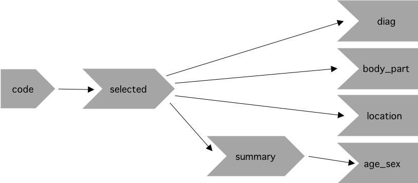
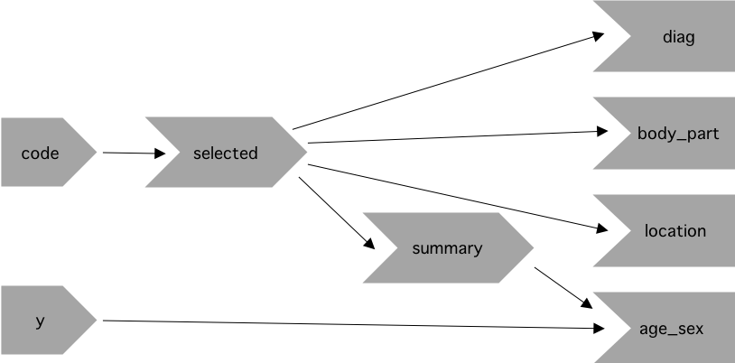
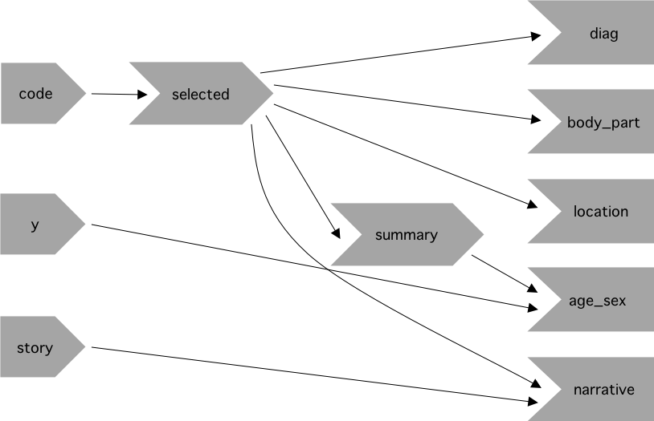

# Case Study: ER Injuries

### Exercise 5.8.1 {-}

Draw the reactive graph for each app.

:::solution
#### Solution {-}

##### Prototype {-}

The prototype application has a single input, `input$code`, which is used to
generate the `selected()` reactive. This reactive is used directly in 3
outputs, `output$diag`, `output$body_part`, and `output$location`, and it is
also used indirectly in the `output$age_sex` plot via the `summary()` reactive.

<center>
{width=500px}
</center>
<br>

##### Rate vs. Count {-}

Building on the prototype, we create a second input `input$y` which is used
along with the `summary()` reactive to create the `output$age_sex` plot.

<center>
{width=500px}
</center>
<br>

##### Narrative {-}

Building on the application once more, we create an `output$narrative` that
depends on the `selected()` reactive and a new input, `input$story`.

<center>
{width=500px}
</center>
:::

<!---------------------------------------------------------------------------->
<!---------------------------------------------------------------------------->
<!---------------------------------------------------------------------------->

### Exercise 5.8.2 {-}

What happens if you flip `fct_infreq()` and `fct_lump()` in the code that
reduces the summary tables?

:::solution
#### Solution {-}

As in the book, we will use the datasets `injuries`, `products`, and
`population` appearing here:
https://github.com/hadley/mastering-shiny/blob/master/neiss/data.R.

Flipping the order of `fct_infreq()` and `fct_lump()` will only change the
factor levels order. In particular, the function `fct_infreq()` orders the
factor levels by frequency, and the function `fct_lump()` also orders the
factor levels by frequency but it will only keep the top `n` factors and label
the rest as `Other`.

```{r, include=FALSE}
library(forcats)
library(tidyverse)
library(neiss)

# Note: these datasets are copied over from https://github.com/hadley/mastering-shiny/blob/master/neiss/data.R.

top_prod <- injuries %>%
  filter(trmt_date >= as.Date("2017-01-01"), trmt_date < as.Date("2018-01-01")) %>%
  count(prod1, sort = TRUE) %>%
  filter(n > 5 * 365)

injuries <- injuries %>%
  filter(trmt_date >= as.Date("2017-01-01"), trmt_date < as.Date("2018-01-01")) %>%
  semi_join(top_prod, by = "prod1") %>%
  mutate(age = floor(age), sex = tolower(sex), race = tolower(race)) %>%
  filter(sex != "unknown") %>%
  select(trmt_date, age, sex, race, body_part, diag, location, prod_code = prod1, weight, narrative)
```

For example, let's look at the number of times each level within `diag` occurs
in the `injuries` dataset:

```{r}
injuries %>%
  group_by(diag) %>%
  count() %>%
  arrange(-n)
```

If we apply `fct_infreq()` first, then it will reorder the factors in
descending order as seen in the previous output. If afterwards we apply
`fct_lump()`, then it will lump together everything after the nth most commonly
seen level.

```{r, message=FALSE, warning=FALSE}
diag <- injuries %>%
  mutate(diag = fct_lump(fct_infreq(diag), n = 5)) %>%
  pull(diag)

levels(diag)
```

Conversely, if we apply `fct_lump()` first, then it will make the most
frequently seen factor `Other`. If afterwards we apply `fct_infreq()`, then it
will label the first level as `Other` and not as `Laceration`, which was the
case for the previous code.

```{r, warning=FALSE, message=FALSE}
diag <- injuries %>%
  mutate(diag = fct_infreq(fct_lump(diag, n = 5))) %>%
  pull(diag)

levels(diag)
```

:::

<!---------------------------------------------------------------------------->
<!---------------------------------------------------------------------------->
<!---------------------------------------------------------------------------->

### Exercise 5.8.3 {-}

Add an input control that lets the user decide how many rows to show in the
summary tables.

:::solution
#### Solution {-}

Our function `count_top` is responsible for grouping our variables into a set
number of factors, lumping the rest of the values into "Other". The function
has an argument `n` which is set to `5`. By creating a `numericInput` called
`rows` we can let the user set the number of `fct_infreq` dynamically. However,
because `fct_infreq` is the number of factors + `Other`, we need to subtract 1
from what the user selects in order to display the number of rows they input.

```{r, eval=FALSE}
library(shiny)
library(forcats)
library(neiss)
library(dplyr)
library(ggplot2)

# Note: these exercises use the datasets `injuries`, `products`, and
# `population` as created here:
# https://github.com/hadley/mastering-shiny/blob/master/neiss/data.R

count_top <- function(df, var, n = 5) {
  df %>%
    mutate({{ var }} := fct_lump(fct_infreq({{ var }}), n = n)) %>%
    group_by({{ var }}) %>%
    summarise(n = as.integer(sum(weight)))
}

ui <- fluidPage(
  fluidRow(
    column(8, selectInput("code", "Product",
                          choices = setNames(products$prod_code, products$title),
                          width = "100%")
    ),
    column(2, numericInput("rows", "Number of Rows",
                           min = 1, max = 10, value = 5)),
    column(2, selectInput("y", "Y Axis", c("rate", "count")))
  ),
  fluidRow(
    column(4, tableOutput("diag")),
    column(4, tableOutput("body_part")),
    column(4, tableOutput("location"))
  ),
  fluidRow(
    column(12, plotOutput("age_sex"))
  ),
  fluidRow(
    column(2, actionButton("story", "Tell me a story")),
    column(10, textOutput("narrative"))
  )
)

server <- function(input, output, session) {
  selected <- reactive(injuries %>% filter(prod_code == input$code))
  
  # Find the maximum possible of rows.
  max_no_rows <- reactive(
    max(length(unique(selected()$diag)),
        length(unique(selected()$body_part)),
        length(unique(selected()$location)))
  )
  
  # Update the maximum value for the numericInput based on max_no_rows().
  observeEvent(input$code, {
    updateNumericInput(session, "rows", max = max_no_rows())
  })
  
  table_rows <- reactive(input$rows - 1)
  
  output$diag <- renderTable(
    count_top(selected(), diag, n = table_rows()), width = "100%")
  
  output$body_part <- renderTable(
    count_top(selected(), body_part, n = table_rows()), width = "100%")
  
  output$location <- renderTable(
    count_top(selected(), location, n = table_rows()), width = "100%")
  
  summary <- reactive({
    selected() %>%
      count(age, sex, wt = weight) %>%
      left_join(population, by = c("age", "sex")) %>%
      mutate(rate = n / population * 1e4)
  })
  
  output$age_sex <- renderPlot({
    if (input$y == "count") {
      summary() %>%
        ggplot(aes(age, n, colour = sex)) +
        geom_line() +
        labs(y = "Estimated number of injuries") +
        theme_grey(15)
    } else {
      summary() %>%
        ggplot(aes(age, rate, colour = sex)) +
        geom_line(na.rm = TRUE) +
        labs(y = "Injuries per 10,000 people") +
        theme_grey(15)
    }
  })
  
  output$narrative <- renderText({
    input$story
    selected() %>% pull(narrative) %>% sample(1)
  })
}

shinyApp(ui, server)
```
:::

<!---------------------------------------------------------------------------->
<!---------------------------------------------------------------------------->
<!---------------------------------------------------------------------------->

### Exercise 5.8.4 {-}

Provide a way to step through every narrative systematically with forward and
backward buttons.

Advanced: Make the list of narratives "circular" so that advancing forward from
the last narrative takes you to the first.

:::solution
#### Solution {-}

We can add two buttons `prev_story` and `next_story` to iterate through the
narrative. In addition, we can include a reactive value, `story`, that keeps
track of the current position in the narrative. When the button `prev_story` is
pressed, `story` decreases by one. Similarly, when the button `next_story` is
pressed, `story` increases by one.
To do the advanced part, we use the mod function. This allows us to keep
`story` between 1 and the current narrative's length, and simulate the "circular" motion.
```{r, eval=FALSE}
library(shiny)
library(forcats)
library(neiss)
library(dplyr)
library(ggplot2)

# Note: these exercises use the datasets `injuries`, `products`, and
# `population` as created here:
# https://github.com/hadley/mastering-shiny/blob/master/neiss/data.R

count_top <- function(df, var, n = 5) {
  df %>%
    mutate({{ var }} := fct_lump(fct_infreq({{ var }}), n = n)) %>%
    group_by({{ var }}) %>%
    summarise(n = as.integer(sum(weight)))
}

ui <- fluidPage(
  fluidRow(
    column(8, selectInput("code", "Product",
                          choices = setNames(products$prod_code, products$title),
                          width = "100%")
    ),
    column(2, numericInput("rows", "Number of Rows",
                           min = 1, max = 10, value = 5)),
    column(2, selectInput("y", "Y Axis", c("rate", "count")))
  ),
  fluidRow(
    column(4, tableOutput("diag")),
    column(4, tableOutput("body_part")),
    column(4, tableOutput("location"))
  ),
  fluidRow(
    column(12, plotOutput("age_sex"))
  ),
  fluidRow(
    column(2, actionButton("prev_story", "Previous story")),
    column(2, actionButton("next_story", "Next story")),
    column(8, textOutput("narrative"))
  )
)

server <- function(input, output, session) {
  selected <- reactive(injuries %>% filter(prod_code == input$code))
  
  # Find the maximum possible of rows.
  max_no_rows <- reactive(
    max(length(unique(selected()$diag)),
        length(unique(selected()$body_part)),
        length(unique(selected()$location)))
  )
  
  # Update the maximum value for the numericInput based on max_no_rows().
  observeEvent(input$code, {
    updateNumericInput(session, "rows", max = max_no_rows())
  })
  
  table_rows <- reactive(input$rows - 1)
  
  output$diag <- renderTable(
    count_top(selected(), diag, n = table_rows()), width = "100%")
  
  output$body_part <- renderTable(
    count_top(selected(), body_part, n = table_rows()), width = "100%")
  
  output$location <- renderTable(
    count_top(selected(), location, n = table_rows()), width = "100%")
  
  summary <- reactive({
    selected() %>%
      count(age, sex, wt = weight) %>%
      left_join(population, by = c("age", "sex")) %>%
      mutate(rate = n / population * 1e4)
  })
  
  output$age_sex <- renderPlot({
    if (input$y == "count") {
      summary() %>%
        ggplot(aes(age, n, colour = sex)) +
        geom_line() +
        labs(y = "Estimated number of injuries") +
        theme_grey(15)
    } else {
      summary() %>%
        ggplot(aes(age, rate, colour = sex)) +
        geom_line(na.rm = TRUE) +
        labs(y = "Injuries per 10,000 people") +
        theme_grey(15)
    }
  })
  
  # Store the maximum posible number of stories.
  max_no_stories <- reactive(length(selected()$narrative))
  
  # Reactive used to save the current position in the narrative list.
  story <- reactiveVal(1)
  
  # Reset the story counter if the user changes the product code. 
  observeEvent(input$code, {
    story(1)
  })
  
  # When the user clicks "Next story", increase the current position in the
  # narrative but never go beyond the interval [1, length of the narrative].
  # Note that the mod function (%%) is keeping `current`` within this interval.
  observeEvent(input$next_story, {
    story((story() %% max_no_stories()) + 1)
  })
  
  # When the user clicks "Previous story" decrease the current position in the
  # narrative. Note that we also take advantage of the mod function.
  observeEvent(input$prev_story, {
    story(((story() - 2) %% max_no_stories()) + 1)
  })
  
  output$narrative <- renderText({
    selected()$narrative[story()]
  })
}

shinyApp(ui, server)
```
:::
