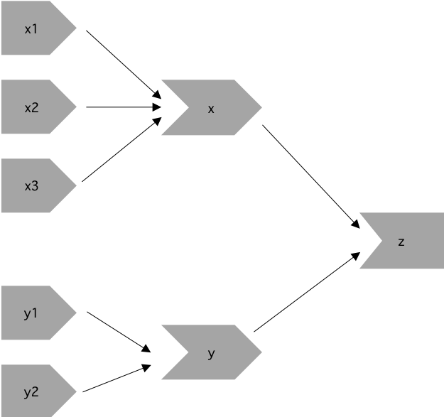

# Basic Reactivity

### Exercise 4.3.6.1 {-}

Draw the reactive graph for the following server functions:
```{r, eval=FALSE}
server1 <- function(input, output, session) {
  c <- reactive(input$a + input$b)
  e <- reactive(c() + input$d)
  output$f <- renderText(e())
}

server2 <- function(input, output, session) {
  x <- reactive(input$x1 + input$x2 + input$x3)
  y <- reactive(input$y1 + input$y2)
  output$z <- renderText(x() / y())
}

server3 <- function(input, output, session) {
  d <- reactive(c() ^ input$d)
  a <- reactive(input$a * 10)
  c <- reactive(b() / input$c)
  b <- reactive(a() + input$b)
}
```

:::solution
#### Solution {-}

To create the reactive graph we need to consider the inputs, reactive
expressions, and outputs of the app.

For `server1` we have the following objects:

- inputs: `input$a`, `input$b`, and `input$d`
- reactives: `c()` and `e()`
- outputs: `output$f`

Inputs `input$a` and `input$b` are used to create `c()`, which is combined with
`input$d` to create `e()`. The output depends only on `e()`.

<center>
{width=500px}
</center>
<br>

For `server2` we have the following objects:

- inputs: `input$y1`, `input$y2`, `input$x1`, `input$x2`, `input$x3`
- reactives: `y()` and `x()`
- outputs: `output$z`

Inputs `input$y1` and `input$y2` are needed to create the reactive `y()`. In
addition, inputs `input$x1`, `input$x2`, and `input$x3` are required to create
the reactive `x()`. The output depends on both `x()` and `y()`.

<center>
{width=400px}
</center>
<br>

For `server3` we have the following objects:

- inputs: `input$a`, `input$b`, `input$c`, `input$d`
- reactives: `a()`, `b()`, `c()`, `d()`

As we can see below, `a()` relies on `input$a`, `b()` relies on both `a()` and
`input$b`, and `c()` relies on both `b()` and `input$c`. The final output
depends on both `c()` and `input$d`.

<center>
{width=600px}
</center>
<br>
:::

<!---------------------------------------------------------------------------->
<!---------------------------------------------------------------------------->
<!---------------------------------------------------------------------------->

### Exercise 4.3.6.2 {-}

Why will this code fail?

```{r, eval=FALSE}
var <- reactive(df[input$var])
range <- reactive(range(var(), na.rm = TRUE))
```

Why is `var()` a bad name for a reactive?

:::solution
#### Solution {-}

This code doesn't work because we called our reactive `range`, so when we call the `range` function we're actually calling our new reactive. If we change the name of the reactive from `range` to `col_range` then the code will work. Similarly, `var()` is not a good name for a reactive because it's already a function to compute the variance of `x`! `?cor::var`

```{r, eval=FALSE}
library(shiny)

df <- mtcars

ui <- fluidPage(
    selectInput("var", NULL, choices = colnames(df)),
    verbatimTextOutput("debug")
)

server <- function(input, output, session) {
    col_var <- reactive( df[input$var] )
    col_range <- reactive({ range(col_var(), na.rm = TRUE ) })
    output$debug <- renderPrint({ col_range() })

}

shinyApp(ui = ui, server = server)
```

:::

<!---------------------------------------------------------------------------->
<!---------------------------------------------------------------------------->
<!---------------------------------------------------------------------------->

### Exercise 4.4.6.1 {-}

Use reactive expressions to reduce the duplicated code in the following simple
apps.

:::solution
#### Solution {-}

:::note
Unclear about the apps mentioned in the exercise.
:::

:::
