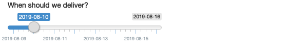

# Basic UI

### Exercise 3.2.8.1 {-}

When space is at a premium, it's useful to label text boxes using a placeholder that appears _inside_ the text entry area. How do you call `textInput()` to
generate the UI below?

<br>
<center>

</center>

:::solution
#### Solution {-}

Looking at the output of `?textInput`, we see the argument `placeholder` which
takes:

> A character string giving the user a hint as to what can be entered into
> the control.

Therefore, we can use the `textInput` with arguments as shown below to generate
the desired UI.


```r
textInput("text", "", placeholder = "Your name")
```
:::

<!---------------------------------------------------------------------------->
<!---------------------------------------------------------------------------->
<!---------------------------------------------------------------------------->

### Exercise 3.2.8.2 {-}

Carefully read the documentation for `sliderInput()` to figure out how to
create a date slider, as shown below.

<br>
<center>

</center>

:::solution
#### Solution {-}

To create such slider, we need the following code.

```r
sliderInput(
  "dates",
  "When should we deliver?",
  min = as.Date("2019-08-09"),
  max = as.Date("2019-08-16"),
  value = as.Date("2019-08-10")
)
```
:::

<!---------------------------------------------------------------------------->
<!---------------------------------------------------------------------------->
<!---------------------------------------------------------------------------->

### Exercise 3.2.8.3 {-}

If you have a moderately long list, it's useful to create sub-headings that
break the list up into pieces. Read the documentation for `selectInput()` to
figure out how. (Hint: the underlying HTML is called `<optgroup>`.)

:::solution
#### Solution {-}

We can make the `choices` argument a list of key-value pairs where the keys
represent the sub-headings and the values are lists containing the categorized
elements by keys. As an illustration, the following example separates animal breeds into two keys (categories): "dogs" and "cats".


```r
selectInput(
  "breed",
  "Select your favorite animal breed:",
  choices =
    list(`dogs` = list('German Shepherd', 'Bulldog', 'Labrador Retriever'),
         `cats` = list('Persian cat', 'Bengal cat', 'Siamese Cat'))
)
```

If you run the snippet above in the console, you will see the HTML code needed
to generate the input. You can also see the `<optgroup>` as hinted in the
exercise.
:::

<!---------------------------------------------------------------------------->
<!---------------------------------------------------------------------------->
<!---------------------------------------------------------------------------->

### Exercise 3.2.8.4 {-}

Create a slider input to select values between 0 and 100 where the interval
between each selectable value on the slider is 5. Then, add animation to the
input widget so when the user presses play the input widget scrolls through
automatically.

:::solution
#### Solution {-}

We can set the interval between each selectable value using the `step`
argument. In addition, by setting `animate = TRUE`, the slider will
automatically animate once the user presses play.


```r
  sliderInput("number", "Select a number:",
              min = 0, max = 100, value = 0, 
              step = 5, animate = TRUE)
```
:::

<!---------------------------------------------------------------------------->
<!---------------------------------------------------------------------------->
<!---------------------------------------------------------------------------->

### Exercise 3.2.8.5 {-}

Using the following numeric input box the user can enter any value between 0
and 1000. What is the purpose of the step argument in this widget?


```r
numericInput("number", "Select a value", value = 150, min = 0, max = 1000, step = 50)
```

:::solution
#### Solution {-}

The step argument is the amount by which the `numericInput` value is
incremented (resp. decreased) when the user clicks the up (resp. down) arrow.
In the previous example, when the user clicks the up (resp. down) arrow the
numeric value will increase (resp. decrease) by 50. Note: by using a
`numericInput` the user still has the ability to type *any* number.
:::

<!---------------------------------------------------------------------------->
<!---------------------------------------------------------------------------->
<!---------------------------------------------------------------------------->

### Exercise 3.3.5.1 {-}

Re-create the Shiny app from the plots section, this time setting height to
300px and width to 700px.

:::solution
#### Solution {-}

The function `plotOutput` can take on static `width` and `height` arguments.
Using the app from the plots section, we only need to add the height argument
and modify the width.


```r
library(shiny)

ui <- fluidPage(
  plotOutput("plot", width = "700px", height = "300px")
)

server <- function(input, output, session) {
  output$plot <- renderPlot(plot(1:5), res = 96)
}

shinyApp(ui, server)
```
:::

<!---------------------------------------------------------------------------->
<!---------------------------------------------------------------------------->
<!---------------------------------------------------------------------------->

### Exercise 3.3.5.2 {-}

Update the options for renderDataTable() below so that the table is displayed, but nothing else (i.e. remove the search, ordering, and filtering commands). You’ll need to read ?renderDataTable and review the options at https://datatables.net/reference/option/.


```r
ui <- fluidPage(
  dataTableOutput("table")
)
server <- function(input, output, session) {
  output$table <- renderDataTable(mtcars, options = list(pageLength = 5))
}
```

:::solution
#### Solution {-}

We can achieve this by setting `ordering` and `searching` to `FALSE` within the
`options` list.


```r
library(shiny)

ui <- fluidPage(
  dataTableOutput("table")
)

server <- function(input, output, session) {
  output$table <- renderDataTable(
    mtcars, options = list(ordering = FALSE, searching = FALSE))
}

shinyApp(ui, server)
```
:::

### Exercise 3.4.6.1 {-}

Create an app that contains two plots, each of which takes up half the app (regardless of what size the whole app is)

:::solution
#### Solution {-}

When creating the layout of a shiny app, you can use the `fluidRow` function to
control the width of the objects it contains. This function can have columns
and such columns can be set to have widths ranging from 1-12. Note that columns
width within a `fluidRow` container should add up to 12.

For our exercise, we need two columns of 50% width each, i.e., we should set
the width of each column to 6.


```r
library(shiny)

ui <- fluidPage(
  fluidRow(
    column(width = 6, plotOutput("plot1")),
    column(width = 6, plotOutput("plot2"))
  )
)
server <- function(input, output, session) {
  output$plot1 <- renderPlot(plot(1:5))
  output$plot2 <- renderPlot(plot(1:5))
}

shinyApp(ui, server)
```
:::

### Exercise 3.4.6.2 {-}

Modify the Central Limit Theorem app so that the sidebar is on the right
instead of the left.

:::solution
#### Solution {-}

Looking at `?sidebarLayout` we can simply set the `position` argument to
`right`. We only need to modify the UI of the app.


```r
ui <- fluidPage(
  headerPanel("Central limit theorem"),
  sidebarLayout(
    position = "right",
    sidebarPanel(
      numericInput("m", "Number of samples:", 2, min = 1, max = 100)
    ),
    mainPanel(
      plotOutput("hist")
    )
  )
)
```
:::

### Exercise 3.4.6.3 {-}

Browse the themes available in the shinythemes package, pick an attractive
theme, and apply it to the Central Limit Theorem app.

:::solution
#### Solution {-}

We can browse the themes [here](https://rstudio.github.io/shinythemes/) and
apply it by setting the `theme` argument within `fluidPage` to
`shinythemes::shinytheme("theme_name")`


```r
library(shinythemes)

ui <- fluidPage(
  theme = shinythemes::shinytheme("darkly"),
  headerPanel("Central limit theorem"),
  sidebarLayout(
    position = "right",
    sidebarPanel(
      numericInput("m", "Number of samples:", 2, min = 1, max = 100)
    ),
    mainPanel(
      plotOutput("hist")
    )
  )
)

server <- function(input, output, session) {
  output$hist <- renderPlot({
    means <- replicate(1e4, mean(runif(input$m)))
    hist(means, breaks = 20)
  })
}

shinyApp(ui, server)
```
:::
